# E-Commerce Microservices Sécurisé avec Oauth2, OIDC et Keycloak

Ce projet est une plateforme e-commerce construite selon une **architecture microservices sécurisée**. Il intègre **OAuth2/OpenID Connect** pour la sécurité via **Keycloak** comme serveur d'identité et d'authentification.

---

## Table of Contents

1. [Introduction](#introduction)
2. [Architecture Overview](#architecture-overview)
3. [Technologies Utilisées](#technologies-utilisées)
4. [Microservices](#microservices)
5. [Sécurité](#sécurité)
6. [Prérequis](#prérequis)
7. [Démarrage](#démarrage)
8. [Aperçu](#aperçu)

---

## Introduction

Ce projet montre la mise en œuvre d'une architecture e-commerce basée sur **microservices**. Chaque service est découplé, scalable, et communique via des API REST ou Feign pour inter-service.

---

## Architecture Overview

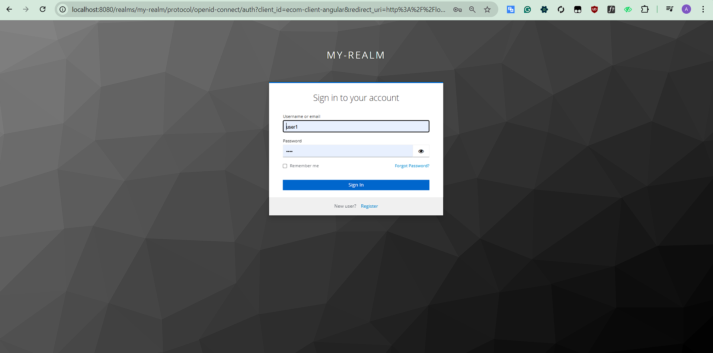

### Points Clés :
- **Découplage des services** pour une meilleure scalabilité.
- **Service Discovery** pour enregistrer et découvrir dynamiquement les services.
- **API Gateway** pour un accès unifié aux clients.
- **OAuth2 et OIDC** pour une sécurité robuste avec Keycloak.

---

## Technologies Utilisées

- **Spring Boot** : Framework pour microservices.
- **Spring Cloud** : Découverte des services, configuration centralisée.
- **Spring Security OAuth2** : Authentification sécurisée.
- **Keycloak** : Fournisseur d'identité OAuth2 et OIDC.
- **Feign** : Communication inter-services.
- **JPA/Hibernate** : ORM pour la gestion des bases de données.
- **H2 Database** : Base de données légère pour les tests.
- **Eureka** : Service de registre et découverte.
- **Maven** : Gestionnaire de build et dépendances.

---

## Microservices

### 1. **Order Service**
- Gère les commandes clients.
- Communique avec Inventory Service pour vérifier les stocks.

### 2. **Inventory Service**
- Gestion des stocks et inventaire.
- Fournit des API pour consulter et mettre à jour les stocks.

### 3. **Config Service**
- Configuration centralisée pour les microservices via Spring Cloud Config.

### 4. **Discovery Service**
- Service Eureka pour l'enregistrement dynamique des services.

### 5. **Gateway Service**
- API Gateway pour unifier les requêtes et gérer les préoccupations transversales comme l'authentification.

### 6. **Keycloak Server**
- Fournit OAuth2 et OpenID Connect pour la sécurité des services.

---

## Sécurité

La sécurité est assurée par **Keycloak**, qui implémente :
- **OAuth2** pour l'authentification et la gestion des tokens.
- **OpenID Connect (OIDC)** pour sécuriser les microservices.
- Chaque service utilise **Spring Security** pour valider les tokens JWT envoyés par Keycloak.

---

## Prérequis

- Java 17+
- Maven
- Docker (pour lancer Keycloak)
- H2 Database

---

## Démarrage

1. **Cloner le projet** :
   ```bash
   git clone https://github.com/username/E-Commerce-Microservices.git
2. **Démarrer Keycloak avec Docker** :
   ```bash
   docker run -d --name keycloak -p 8080:8080 \
   -e KEYCLOAK_ADMIN=admin \
   -e KEYCLOAK_ADMIN_PASSWORD=admin \
   quay.io/keycloak/keycloak:latest start-dev
3. **Configurer Keycloak** :
   ```bash
   Créez un Realm : ecommerce-realm.
   Configurez un Client : ecommerce-client (confidential, redirect URL : http://localhost:8080).
## Aperçu
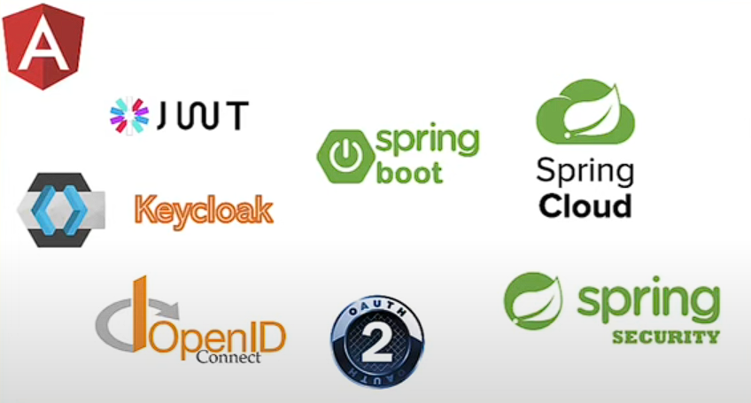
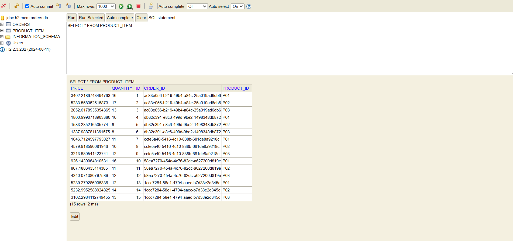
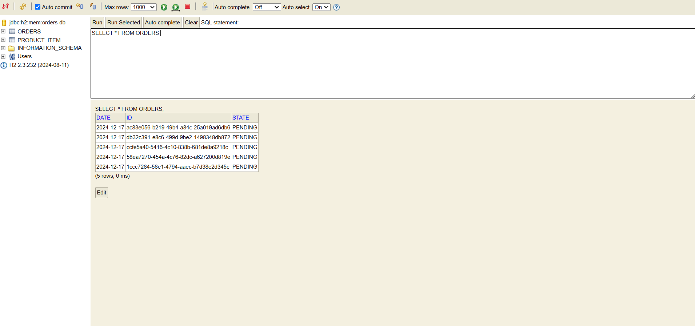
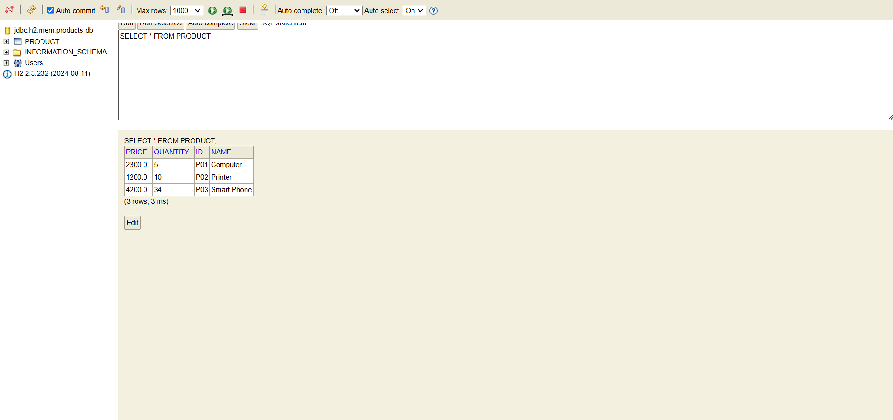
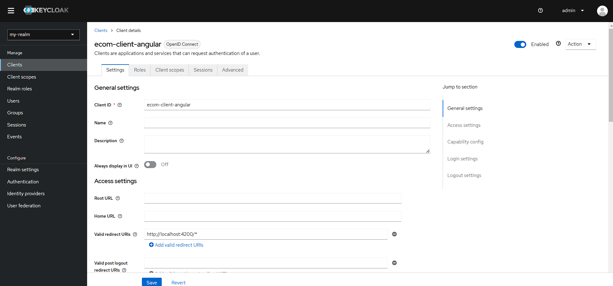
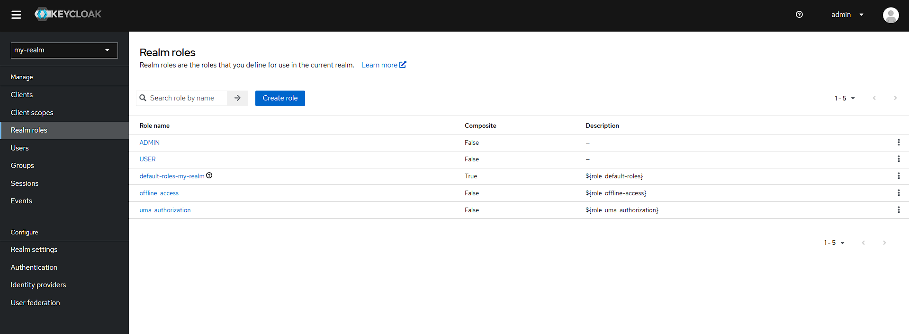
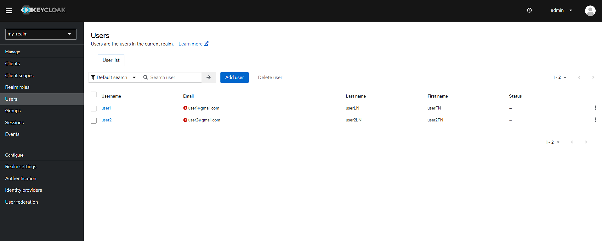

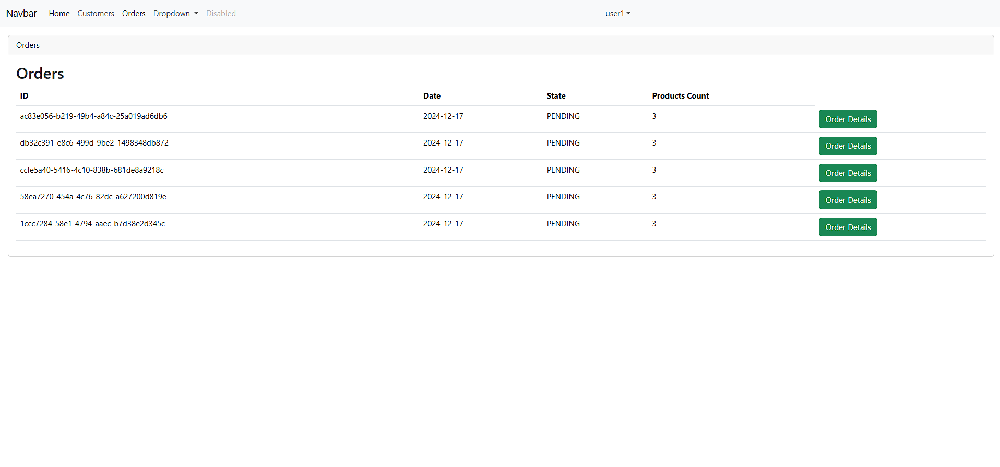
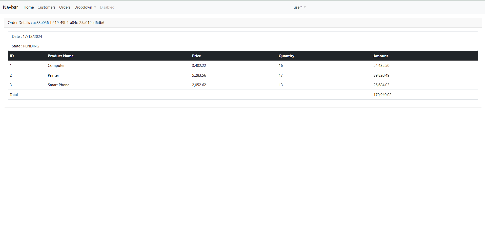
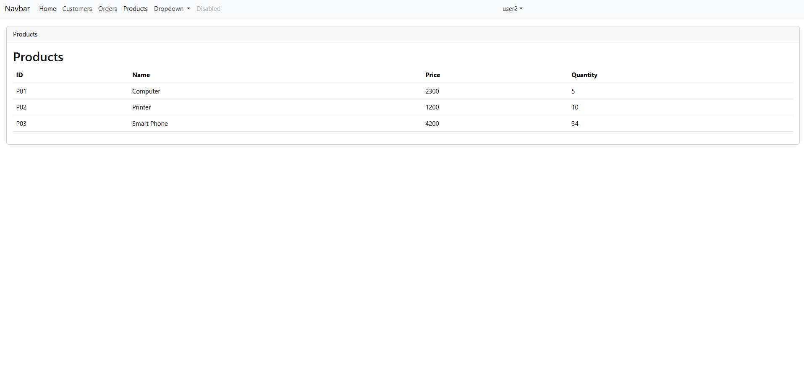
